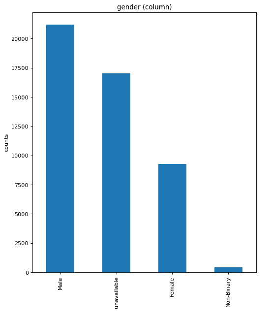
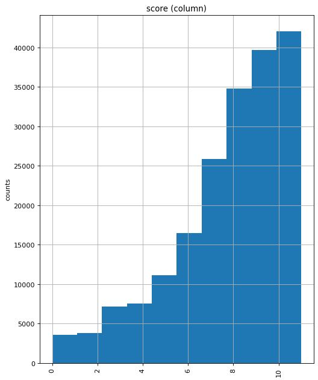

# Recommendation System for an Anime Streaming Service

Author: Samuel Song

## Overview:
This project was to create a recommendation system. I chose a database from kaggle which had a large database of information which was all from MyAnimeList. 
 
For my presentation, I made up a scenario where the streaming service wasn't launched yet, we are still in the early stages of creating the whole system and this presentation is an update to the project manager/ UIUX people. I used this scenario to sort of explain why the recommendation systems aren't 100% perfect yet. (Or atleast in my eyes these models aren't complete, there is still much work to be done)
 

## Deeper look into the data.

Data provided came from [kaggle](https://www.kaggle.com/datasets/marlesson/myanimelist-dataset-animes-profiles-reviews).

There were 3 files: 

- Anime: contained about 16k shows
- Profile: contained about 80k profiles
- Review: contained about 190k reviews

Then there are files which I created by merging:
- Anime, profile, and review with _export followed:
  - these files are cleaned up versions of each. Done in EDA 2
- merged_df_export:
  - This has profile and shows merged
- merged_rev_df_export:
  - Merged reviews onto the above
- df_anime_nomovie:
  - dropped all shows with less than 2 episodes. This all was also done in EDA 2
- df_anime_all_cleaned:
  - came from EDA 3, just applied some more preprocessing steps to df_anime_export so I wouldnt have to do it again and again on the rec systems
 
 
 
The cleaning done to these df's weren't anything crazy. Dropped dupes, filled nulls with specific values so I know it used to be null if it ever comes up.
 

## Notebook Guide:
I will explain what is going on in each file here:
 

[Initial EDA](./code/EDA_1.ipynb) under the file EDA_1

- Nothing from here got turned into anything useful exactly. Instead this notebook serves to show what I did to examine and determine how to handle the null values/columns and dupes in the csv's. 
- Towards the end you can see my attempt to merge all 3 df's. It failed in EDA_1, not sure what was wrong with my logic but it kept running out of memory. The text preprocessing that I use in the future also came from this notebook

 

[EDA with visuals and proper exports](./code/EDA_2.ipynb) under the file EDA_2

- This notebook has all my visual EDA done. There were some interesting insights, particuarly being able to see the spread of review scores and breakdown of genders. 

- In gender, there were many who just did not fill in their gender. I believe this was just a simple case of not caring to put in gender.
  - I know now a days there are more than 2 genders, but with how large the 'unknown' gender was, I doubted they were ALL identifying as a different gender. With this understanding I came to the conclusion that I cannot use gender accurately as the imbalance is huge and there is no way to adequately guess which gender the unknown group is. 
- As for review score spread, it is definitely skewed and will no doubt impact the collab rec system. Tried to ask for help addressing this from the projet manager/uiux people by asking them to help encourage new users to give reviews, both good and bad, but more bad would help the rec system model learn.

[EDA with visuals and proper exports](./code/EDA_3.ipynb) under the file EDA_3

- This is a quick one, just engineered anime_df a bit to get rid of 'shows' that were actually movies and applied a preprocessing step to genres here so I wouldnt have to wait in the rec system model to apply this process.

[Collab Rec Model Final](./code/collab_recc_final.ipynb) under the file collab_recc_final

- Collab rec model in here.

[Content Rec Model Final](./code/content_recc_final.ipynb) under the file content_recc_final

- Content rec model in here. 

[Hybrid Model Attempt](./code/content_recc_final.ipynb) under the file hybrid_recc

- This wasn't completed in time.
- Currently at the moment of submitting this for Flatiron, the problems are as follows:
  - I put in give me 5 recs, returns 2.
  - I request 10, I get 5.
    - Clearly something is wrong with the way shows get filtered in. Didn't have time to figure this out before presentation
- Post Flatiron I will keep trying to make this hybrid model work.

[Content Rec Streamlit](./code/streamlit_content_recc.ipynb) under the file streamlit_content_recc
- Contains process of deploying model to streamlit for content rec system
- There are 2 functions because of the fuzzy threshhold.
  - In the function first used, the fuzzy score threshhold of 30 helps ensure we dont get repeats
    - If I search Full Metal Alchemist, I dont want to see the other FMA movies and shows again.
  - But in the function for top 100, I had to drop the fuzzy threshold to 0 as that was killing too many shows for top 100.

[Collab Rec Streamlit](./code/streamlit_collab_recc.ipynb) under the file streamlit_collab_recc
- Contains process of deploying model to streamlit for collab rec system

 
 

## Results
- The collab rec system had a score of about 89% accuracy, given a threshold of 1 point. Meaning if we predict 5.5, and true score was 6, then we counted it as good. Not sure if this is too loose for now, I believe with more reviews in the negatives we can predict this better with a tighter threshold.
- Content rec system can be versatile, easily applying feature engineering to the database before will dynamically help the rec model produce back different results. The only one demonstrated is top 100 shows to be recommended back, but there are many different ways to filter:
  - By time: pre or post 2000 as an example
  - By genre: 'Action' only and such
  - 'Surprise me': The first model in streamlit_content_recc would be a good one, as the shows are similar in genre but not always top 100 bangers.

## Conclusions
- Tbh these rec models are a lot of fun. Shame I truly understood how they work about a week before the project was due. 
- I believe the next best step would have been to stop working on the content/collab individually and try to create a hybrid of both.
- Doing this may help alleviate some of the grievances I have of trying to create these recc systems individually.
- In a theoretical scenario, as the stream service launches I would be pulling in the new data we get and use that to keep training the model for better recs.
  - Eventually if our own database far outscales MyAnimeList, then I might abandon the MyAnimeList database alltogether for training and just use the inhouse data as that would be more relevant data to our company. (Some reviews from MyAnimeList are from like 2014, and us weebs all know that some shows just don't age well lol)

## Next Steps:
  - Again, in a theoretical scenario where this is being launched for a streaming service:
    - I personally need to make the hybrid model
    - UIUX needs to help implement ways to gather KPI's for each of these models (click through and conversion rate would be good)
      - Click though will help indicate if the recc system is successful in having users try new shows
      - Conversion rate will help us know the rate at which users subscribe, may be an indicator of a successful rec system?
    - Project Mangers need to find the people to implement ways to encourage giving ratings. Not sure who would handle this, but I am no psychologist, I do not know the most optimal way at the moment to get people to give ratings. But this again may be a project for me, figure out how to get people to leave reviews more frequently.

 
 
For any additional questions, please contact me at samueld.song@gmail.com